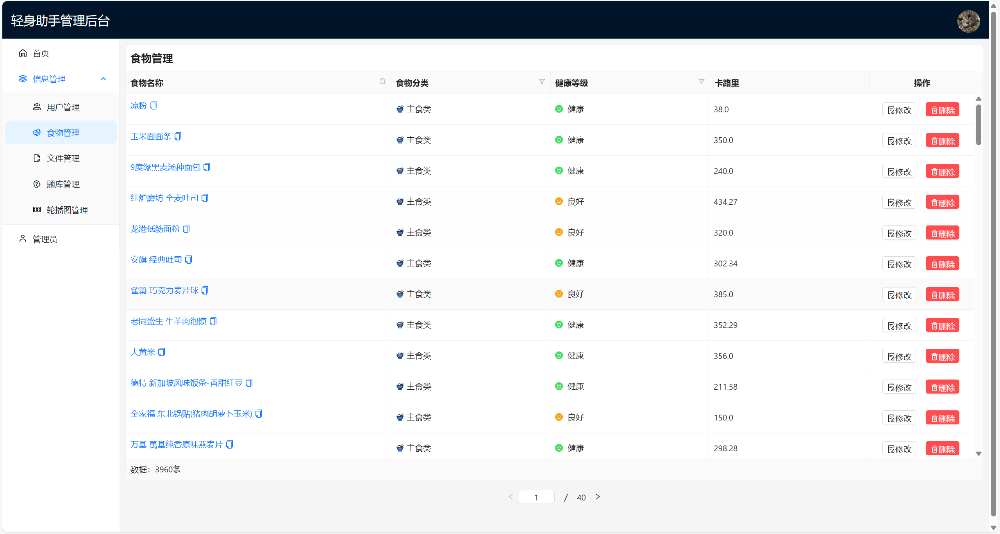

# 轻身助手后台管理系统

轻身助手后台管理系统是面向健康管理应用开发的综合性平台，提供用户、信息、文件、题库、轮播图等模块的高效管理功能。该系统支持细粒度权限控制、清晰的数据展示以及灵活的数据维护能力，旨在提升管理员的操作效率与系统的可扩展性。

## 🧱 系统结构

系统分为以下主要模块：

- **首页**：展示概览信息或统计分析图表（可扩展）。
- **信息管理**
  - 用户信息汇总管理。
- **用户管理**
  - 查看、筛选用户列表（用户名、性别、手机号、生日、头像地址）。
  - 支持 CRUD 操作。
- **食物管理**
  - 食品数据录入、编辑、查询与分类。
- **文件管理**
  - 文件上传、下载与安全删除。
- **题库管理**
  - 管理健康类问答题库，用于评测与推荐。
- **轮播图管理**
  - 首页广告轮播图配置与维护。
- **管理员**
  - 系统用户与权限设置。

## 📊 技术栈

| 分类 | 技术 |
|------|------|
| 前端 | Vue 3 / Element Plus / Axios |
| 后端 | Spring Boot / MyBatis Plus |
| 数据库 | MySQL |
| 安全 | JWT 鉴权 / Spring Security |
| 工具链 | Maven / Git |

## 🛡️ 安全性设计亮点

- **接口安全**：统一鉴权处理，避免未授权访问。
- **文件删除机制**：采用逻辑删除 + 文件粉碎式处理，防止数据恢复。
- **操作日志记录**：管理员操作留痕，确保可追溯性。
- **输入校验**：防止 SQL 注入、XSS 等攻击行为。

## 📷 界面展示



如图所示，用户管理模块支持对用户信息的列表展示与搜索过滤。暂无数据时，自动展示空数据提示。

## 🚀 部署与运行

1. 克隆项目：
   ```bash
   git clone https://github.com/your-repo/lean-assistant-admin.git
   ```
2. 配置数据库连接与 JWT 密钥。
3. 启动后端 Spring Boot 项目。
4. 启动前端 Vue 项目：
   ```bash
   cd frontend
   npm install
   vite dev
   ```

## 📌 后续扩展建议

- 增加数据分析面板（Echarts 集成）。
- 支持多语言界面。
- 集成 AI 推荐模型，提升个性化体验。
- 提供移动端自适应管理入口。

---

