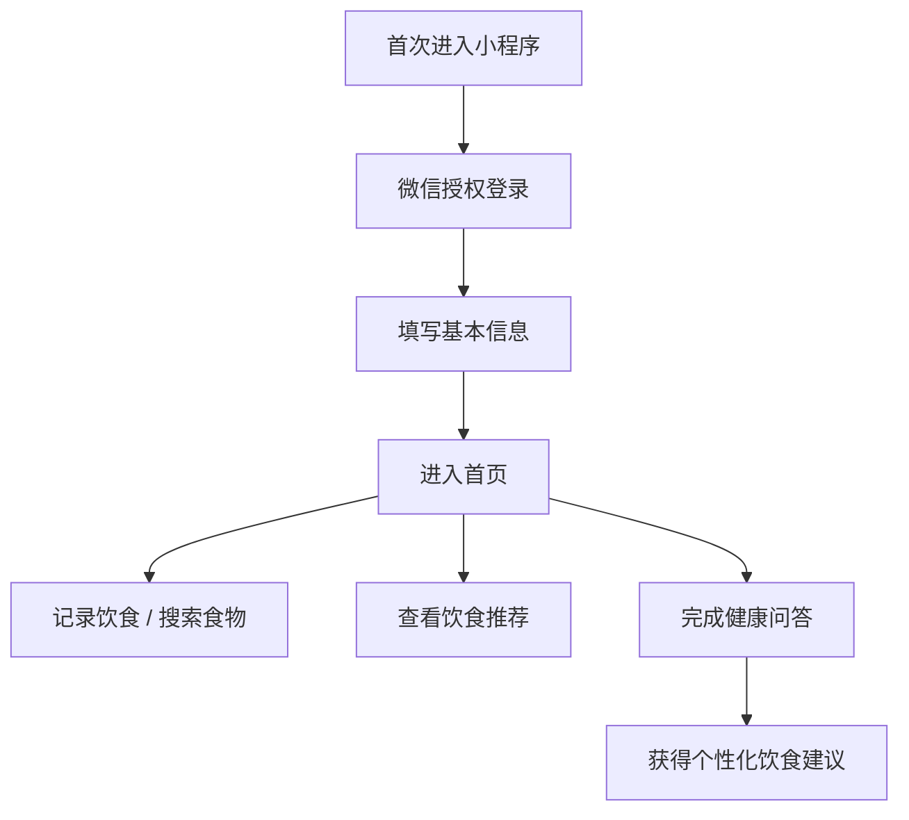

---

# 📱 轻身助手小程序介绍

“轻身助手”小程序是基于微信生态开发的健康管理工具，结合用户身体信息与饮食习惯，提供个性化的健康建议与营养推荐。项目目标是为用户建立科学、便捷的体重管理方案，兼顾可操作性与智能化体验。

---

## 🎯 产品定位

> “为用户打造贴身营养管理管家，轻松管理饮食、科学减重。”

- **面向群体**：有减重、健康饮食需求的普通用户
- **使用场景**：日常饮食记录、食物热量查询、营养建议获取、体重跟踪

---

## 🧩 功能模块

| 模块         | 功能说明 |
|--------------|----------|
| **用户注册与登录** | 基于微信授权，实现快捷登录 |
| **首页推荐** | 展示健康饮食建议、公告、轮播图内容 |
| **饮食记录** | 用户可记录每日饮食、上传图片、自动统计热量 |
| **食物库查询** | 支持搜索食物，查看热量、蛋白质、脂肪、碳水化合物等营养信息 |
| **营养推荐** | 基于用户体型及目标，生成每日饮食建议 |
| **题库问答** | 提供健康饮食知识问答，用于评估用户健康知识水平 |
| **个人信息管理** | 支持编辑用户性别、生日、体重、身高等基本信息 |
| **体重变化图表** | 可视化展示体重变化趋势，支持目标设定与提醒 |
| **管理员反馈入口** | 用户可反馈问题，系统后台可查看处理 |

---

## 🛠️ 技术实现

- **开发平台**：微信小程序（WeChat Mini Program）
- **前端框架**：`uni-app` + `uView UI`
- **后端服务**：基于 Spring Boot 开发，使用 RESTful API 连接
- **数据接口**：通过 Axios 封装请求，连接后端获取用户数据、食物库等内容
- **图表渲染**：基于 ECharts 展示体重变化等图表
- **存储方案**：本地缓存 + 云数据库（MySQL）

---

## 📊 核心特色

- ✅ **个性化营养推荐**：结合用户体型数据，自动匹配热量摄入建议
- 🧠 **智能题库互动**：提升用户健康知识水平
- 📸 **饮食图像上传**：记录更加真实、生动
- 📈 **体重可视分析**：趋势图辅助用户设定目标并监测达成进度

---

## 🧪 用户体验流程

---

## 🧱 系统安全设计

- 所有用户数据通过 HTTPS 传输
- 登录授权使用微信官方 `openid`、`session_key` 机制
- 后台服务接口加入 JWT Token 鉴权
- 食物记录与体重数据绑定用户 UID，防止数据越权

---

## 📌 后续优化方向

- 引入 OCR 图像识别，实现拍照识别食物热量
- 接入微信运动步数，自动调整每日热量推荐
- 联动 AI 大模型，实现语音对话式营养建议

---
